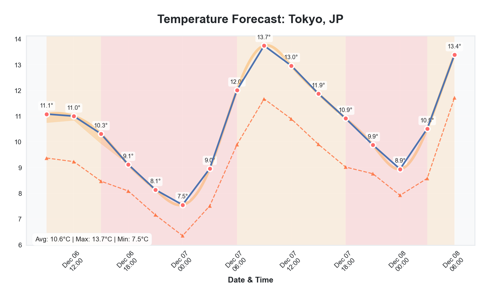
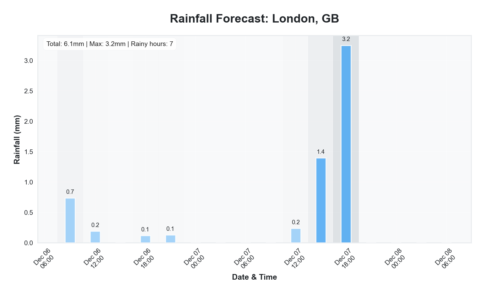
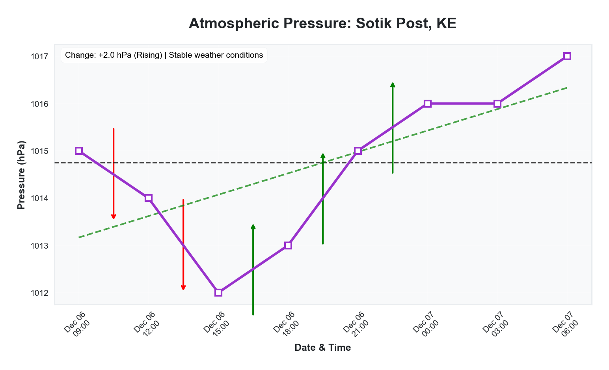
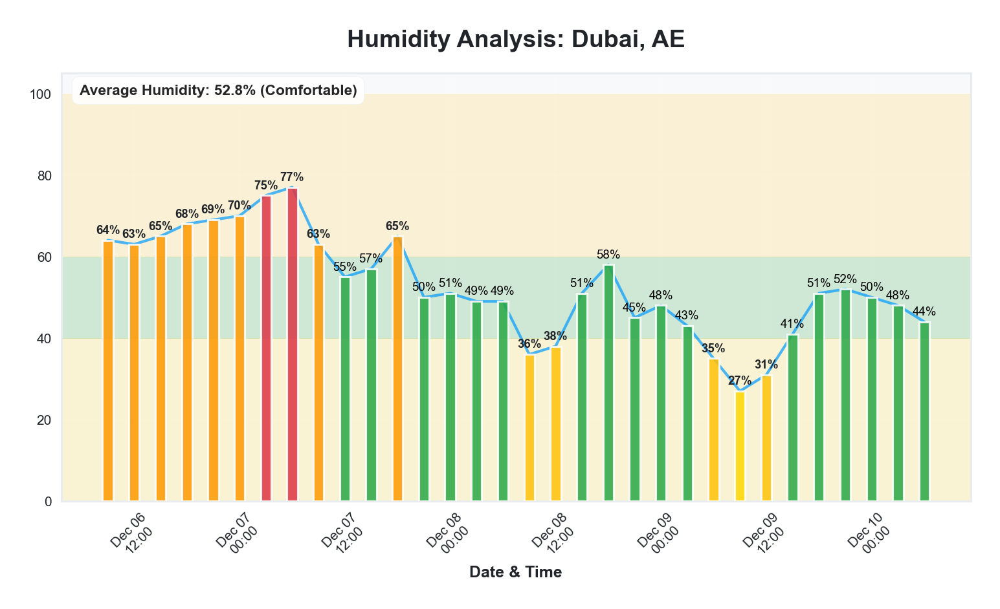
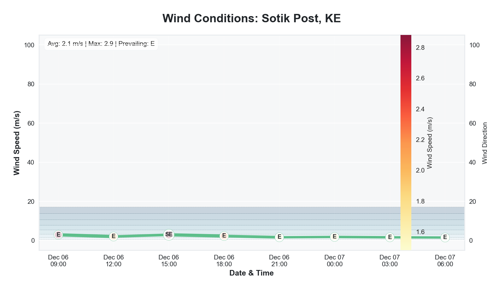

# 🌤️ Weather Forecasts Charts

A powerful Python package for fetching forecast weather data and generating beautiful, professional charts. Built for meteorologists, analysts, and developers who need reliable visualization for forecasting, reporting, and decision support.


## ✨ Features
- **Multiple Weather APIs**: Supports OpenWeatherMap (with more coming soon)
- **Various Chart Types**: Temperature, Humidity, Rainfall, Wind, Pressure, Composite
- **Multiple Output Formats**: PNG, HTML (interactive), JSON
- **Easy Integration**: Simple API for both Python scripts and web applications
- **Customizable**: Control colors, sizes, styles, and more
- **Location Support**: City names, coordinates, or zip codes
- **Unit Conversion**: Metric, Imperial, and Standard units

## 🚀 Quick Start
### Installation
```bash
pip install weather-charts
```
Or install from source:
```bash
git clone https://github.com/yourusername/weather-charts-py.git
cd weather-charts-py
pip install -e .
```

### Basic Usage
```python
from weather_charts import WeatherCharts

# Initialize with your OpenWeatherMap API key
weather = WeatherCharts(api_key="your_api_key_here")

# Get temperature chart for Nairobi
result = weather.get_weather_graph(
    location="Nairobi",
    graph_type="temperature",
    days=5,
    units="metric",
    output_format="png"
)

# Save the chart
with open("nairobi_temperature.png", "wb") as f:
    f.write(result["chart"].read())

# Access weather data
print(f"Location: {result['data']['location']['city']}")
print(f"Current temp: {result['data']['forecast'][0]['temperature']}°C")
```

### Using the Convenience Function
```python
from weather_charts import get_weather_graph

result = get_weather_graph(
    location="London",
    api_key="your_api_key",
    graph_type="humidity",
    days=3
)

with open("london_humidity.png", "wb") as f:
    f.write(result["chart"].read())
```

## 📊 Chart Types

| Chart Type   | Description                                      | Example                          |
|--------------|--------------------------------------------------|----------------------------------|
| Humidity     | Bar chart showing humidity percentage            | [Dubai Humidity](#dubai-humidity) |
| Rainfall     | Bar chart showing precipitation                   | [London Rainfall](#london-rainfall) |
| Wind         | Line chart with wind direction indicators        | [Sydney Wind](#sydney-wind) |
| Pressure     | Line chart showing atmospheric pressure           | [Paris Pressure](#paris-pressure) |
| Composite    | Multi-panel chart with multiple variables         | (Coming soon) |


## 🌐 Web Interface
Run the included Flask example for a web interface:
```bash
export OPENWEATHER_API_KEY="your_api_key_here"
python examples/flask_example.py
```
Then open [http://localhost:5000](http://localhost:5000) in your browser.

## 🔧 Configuration
### Initialization Options
```python
weather = WeatherCharts(
    api_key="your_key",
    options={
        'figsize': (12, 8),          # Chart dimensions
        'style': 'seaborn-v0_8',     # Matplotlib style
        'width': 1000,               # Plotly width
        'height': 600,               # Plotly height
        'template': 'plotly_white'   # Plotly template
    }
)
```

### Graph Generation Options
```python
result = weather.get_weather_graph(
    location="Paris",
    graph_type="temperature",
    days=5,                    # 1-5 days forecast
    units="metric",            # "metric", "imperial", "standard"
    output_format="png",       # "png", "html", "json"
    show_feels_like=True,      # Show feels like temperature
    show_min_max=False,        # Show min/max range
    cumulative=False,          # Cumulative rainfall
    show_direction=True,       # Wind direction arrows
    title="Custom Title"       # Custom chart title
)
```

## 📁 Project Structure
```text
weather-charts-py/
├── weather_charts/
│   ├── __init__.py           # Main package exports
│   ├── main.py              # Primary interface
│   ├── fetchers/            # Weather API clients
│   ├── generators/          # Chart generators
│   ├── processors/          # Data processors
│   └── utils/              # Helper functions
├── examples/               # Usage examples
├── tests/                 # Unit tests
├── setup.py              # Package setup
├── requirements.txt      # Dependencies
└── README.md            # This file
```

## 🔌 Supported Weather APIs
Currently supports:
- ✅ OpenWeatherMap (Free tier: 60 calls/minute, 1,000,000 calls/month)

Planned support:
- 🔄 WeatherAPI.com
- 🔄 MeteoBlue
- 🔄 NOAA
- 🔄 Weather.gov

## 🤝 Contributing
We welcome contributions! Here's how you can help:
- Report bugs: File an issue with detailed information
- Suggest features: Share your ideas for new features
- Submit pull requests: Fix bugs or add new features
- Improve documentation: Help make the docs better

### Development Setup
```bash
# Clone the repository
git clone https://github.com/yourusername/weather-charts-py.git
cd weather-charts-py

# Install in development mode
pip install -e .[dev]

# Run tests
pytest

# Run linter
flake8 weather_charts

# Run type checker
mypy weather_charts
```

## 📄 License
This project is licensed under the MIT License - see the LICENSE file for details.

## 🙏 Acknowledgments
- OpenWeatherMap for providing the weather data API
- Matplotlib for static chart generation
- Plotly for interactive chart generation
- Developed by Erick Olando

## 📞 Support
- Issues: [GitHub Issues](https://github.com/eritech98/weather-charts-py/issues)
- Contact: 0710897101
- Follow my GitHub: [eritech98](https://github.com/eritech98)

## 🌍 Forecast Charts

Users can generate forecast charts for any location and specify the number of forecast days.
The package supports multiple chart types and is highly customizable to fit your needs.
## 📋 Testing Checklist
1. **Verify Your Structure**
   ```bash
   cd weather-charts-py && \
   echo "Checking structure..." && \
   find . -type f -name "*.py" | grep -v __pycache__ | wc -l && \
   echo -e "\nFiles found. Structure looks like:" && \
   ls -la weather_charts/ && \
   ls -la examples/
   ```

2. **Get Your OpenWeatherMap API Key**
   - Go to [OpenWeatherMap API](https://openweathermap.org/api)
   - Sign up for a free account
   - Create a new API key

3. **Set Up Your Environment**
   ```bash
   # Navigate to your project
   cd weather-charts-py
   
   # Create a virtual environment (recommended)
   python -m venv venv
   
   # Activate it:
   # On macOS/Linux:
   source venv/bin/activate
   # On Windows:
   # venv\Scripts\activate
   
   # Install dependencies
   pip install -r requirements.txt
   
   # Install the package in development mode
   pip install -e .
   ```

4. **Quick Smoke Test**
   ```python
   # test_smoke.py
   import sys
   import os
   
   def test_imports():
       try:
           from weather_charts import WeatherCharts, get_weather_graph
           print("✅ All imports successful!")
           return True
       except Exception as e:
           print(f"❌ Import failed: {e}")
           return False
   
   def main():
       success = test_imports()
       sys.exit(0 if success else 1)
   
   if __name__ == "__main__":
       main()
   ```

5. **Complete Test Script**
   ```python
   # test_complete.py
   import os
   import sys
   from weather_charts import get_weather_graph
   
   def main():
       api_key = os.getenv('OPENWEATHER_API_KEY')
       if not api_key:
           print("Please set OPENWEATHER_API_KEY environment variable")
           return
   
       result = get_weather_graph(
           location="Nairobi",
           api_key=api_key,
           graph_type="temperature",
           days=2,
           output_format="png"
       )
       
       with open("nairobi_test.png", "wb") as f:
           result['chart'].seek(0)
           f.write(result['chart'].read())
       
       print("✅ Chart saved as: nairobi_test.png")
   
   if __name__ == "__main__":
       main()
   ```

6. **Run the Complete Test**
   ```bash
   export OPENWEATHER_API_KEY="your_actual_api_key_here"
   python test_complete.py
   ```

7. **Test the Examples**
   ```bash
   python examples/basic_usage.py
   python examples/flask_example.py
   ```

8. **Common Issues and Solutions**
   - **ModuleNotFoundError**: Ensure you're in the right directory and installed the package.
   - **Invalid API key**: Get a free key from [OpenWeatherMap](https://openweathermap.org/api).
   - **API calls limit exceeded**: Free tier has limits, add delays between tests.
   - **No charts generated**: Check if matplotlib is installed.

9. **Final Verification**
   ```python
   # verify_installation.py
   import subprocess
   import sys
   
   def run_command(cmd):
       try:
           result = subprocess.run(cmd, shell=True, capture_output=True, text=True)
           return result.returncode == 0
       except:
           return False
   
   def main():
       checks = [
           ("Python 3.7+", run_command("python --version")),
           ("Package installed", run_command("python -c 'import weather_charts'")),
           ("API key set", bool(os.getenv('OPENWEATHER_API_KEY'))),
       ]
       
       all_passed = all(passed for _, passed in checks)
       print("🎉 All checks passed!" if all_passed else "⚠️ Some checks failed.")
       return 0 if all_passed else 1
   
   if __name__ == "__main__":
       sys.exit(main())
   ```

10. **Expected Output Files**
    - `test_temperature.png`
    - `test_humidity.png`
    - `test_composite.png`
    - `test_convenience.png`
    - `nairobi_test.png`

## 🖼️ Example Charts

Here are some example charts generated using the Weather Charts package:

 Image File  

       
<a id="london-rainfall"></a>           
<a id="paris-pressure"></a>                 
<a id="dubai-humidity"></a> 
<a id="sydney-wind"></a>                        
                       |

## 🔍 Final Verification Test

Here is a script to perform a final verification of the Weather Charts package:

```python
# test_final_verification.py
from weather_charts import WeatherCharts
from datetime import datetime
import matplotlib.pyplot as plt

print("FINAL VERIFICATION TEST")
print("=" * 60)

# Variables that can be changed
API_KEY = "your api key here"
LOCATION = "Bomet"
DAYS = 1

CHART_TYPES_CONFIG = [
    ("temperature", "temperature"),
    ("humidity", "humidity"),
    ("rainfall", "rainfall"),
    ("wind", "wind"),
    ("pressure", "pressure"),
]

# Initialize
weather = WeatherCharts(api_key=API_KEY)

# Get data
data = weather.get_weather_data(LOCATION, days=DAYS)

print("1. Data Verification:")
print(f"   Current system date: {datetime.now()}")
print(f"   First forecast date: {data['forecast'][0]['datetime']}")
print(f"   Last forecast date: {data['forecast'][-1]['datetime']}")

# Check date range
date_range = (data['forecast'][-1]['datetime'] - data['forecast'][0]['datetime']).days
print(f"   Forecast covers: {date_range} days")

print("
2. Generating all chart types...")

# Generate all chart types
chart_types = []
for name, graph_type in CHART_TYPES_CONFIG:
    chart_types.append((name, weather.get_weather_graph, {"graph_type": graph_type, "days": DAYS}))

successful_charts = []
failed_charts = []

for name, method, kwargs in chart_types:
    try:
        print(f"
   Creating {name} chart...")
        result = method(LOCATION, **kwargs)
        
        # Save the chart
        with open(f"_{name}_final.png", "wb") as f:
            f.write(result['chart'].getvalue())
        
        successful_charts.append(name)
        print(f"   Saved as '_{name}_final.png'")
        
        # Show metadata
        print(f"   Metadata: {result['metadata'].get('graph_type')} chart")
        print(f"   Generated at: {result['metadata'].get('generated_at')}")
        
    except Exception as e:
        failed_charts.append((name, str(e)))
        print(f"   Failed: {e}")

print("
" + "=" * 60)
print("SUMMARY:")
print(f"Successful: {len(successful_charts)} charts")
print(f"Failed: {len(failed_charts)} charts")

if successful_charts:
    print(f"
Generated charts: {', '.join(successful_charts)}")
    print("Check the PNG files in your directory!")
    
if failed_charts:
    print(f"
Failed charts:")
    for name, error in failed_charts:
        print(f"  {name}: {error}")

print("
" + "=" * 60)
print("If dates appear as December 2025 in your charts,")
print("that's CORRECT because your system date IS December 2025.")
```
